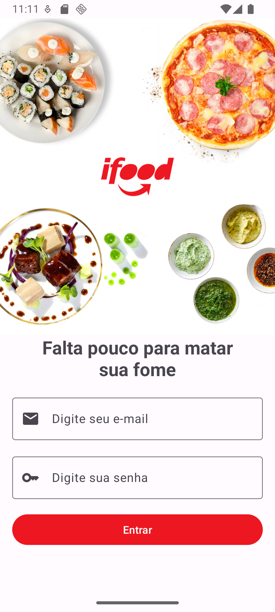
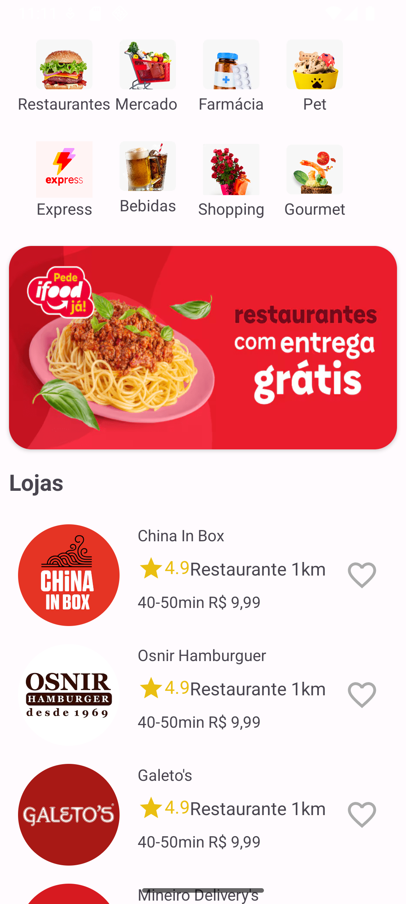
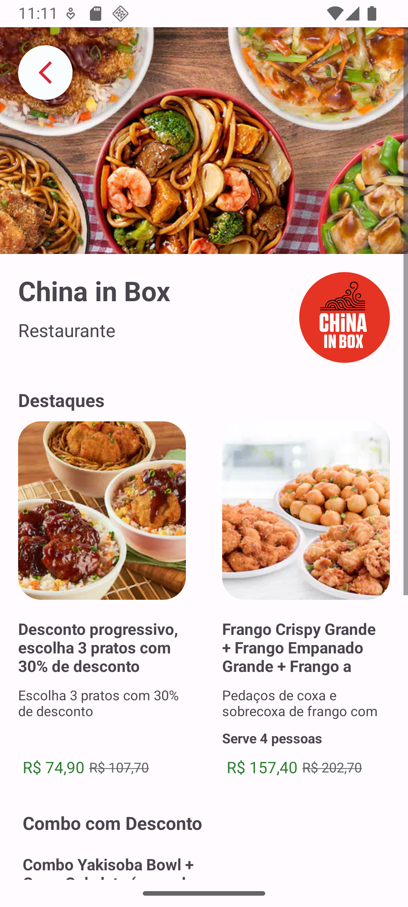
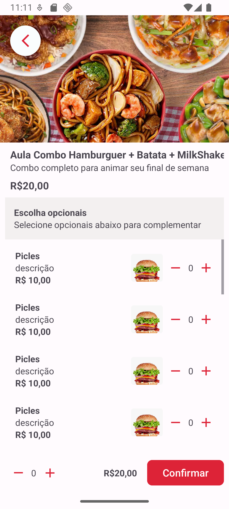
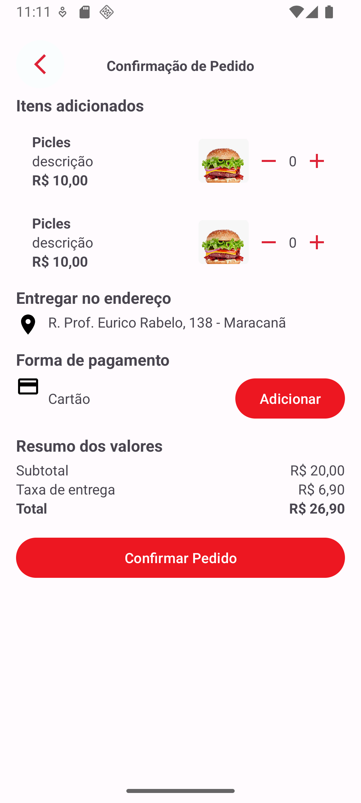

# 🍔 iFood Clone - Projeto de Estudo em Equipe

Este projeto é um **clone simplificado do fluxo do iFood**, desenvolvido como parte de um **desafio proposto pelo BOOSTCAMP da CODANS**, sob mentoria do professor **Jamilton Damasceno**.

O app contém 5 telas com navegação entre elas, simulando a experiência básica de um app de delivery.

---

## 🚀 Funcionalidades Implementadas

Este projeto contém as seguintes **telas principais**:

1. **Tela de Login**  
   Tela inicial simulando o acesso do usuário.

2. **Tela Inicial (Listagem de Restaurantes)**  
   Mostra restaurantes fictícios para navegação.

3. **Detalhes do Restaurante**  
   Exibe informações do restaurante e produtos.

4. **Detalhes do Produto**  
   Tela estática simulando os detalhes de um item.

5. **Tela de Confirmação de Compra**  
   Mostra um resumo fictício da compra.

> ⚠️ Este projeto **não contém ações reais**, como autenticação, chamadas de API ou persistência de dados. O foco foi a pratica do trabalho em equipe.

---

## 🎯 Objetivo do Projeto

O principal objetivo foi **aprender a trabalhar com GitHub em um projeto real**, incluindo:

- Criação e uso de **branches**
- Realização de **pull requests**
- Resolução de **conflitos**
- Organização do código em equipe

---

## 🛠️ Tecnologias Utilizadas

- Kotlin  
- XML 
- Android Studio  
- Material Design 3  
- Git + GitHub (colaboração em equipe)

---

## 👥 Participantes

- [Caio Lima](https://github.com/kaioLimaX)
- [Cristiano Mattos](https://github.com/cristianomattoss)
- [Rodrigo de Oliveira](https://github.com/rodrichu)
- [Gabriel Fernandes](https://github.com/GabrielSantos561)
- [Sóstenes](https://github.com/SARP2010)

---

## 📸 Screenshots

> Adicione aqui imagens do app em funcionamento.

<table>
  <tr>
    <th>Login</th>
    <th>Menu Principal</th>
    <th>Detalhes Restaurante</th>
    <th>Detalhes Produto</th>
    <th>Confirmação</th>
  </tr>
  <tr>
    <td></td>
    <td></td>
    <td></td>
    <td></td>
    <td></td>
  </tr>
</table>

---

## 📚 Sobre o Desafio

Este projeto foi desenvolvido como parte do **BOOSTCAMP CODANS**, uma trilha prática para desenvolvedores Android, com foco em colaboração, versionamento e boas práticas de código.

Mentor do Desafio: **Jamilton Damasceno**  
Plataforma: [https://codans.com.br/](https://codans.com.br/)

---

## 📄 Licença

Este projeto foi desenvolvido para fins **educacionais** e **não possui fins comerciais**.

